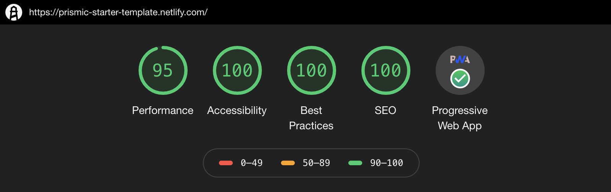

# Static Page with Gatsby (POC)

### Demo
[https://prismic-starter-template.netlify.com](https://prismic-starter-template.netlify.com)

### Latest report

You can see more [here](reports/prismic-starter-template.netlify.com-20191112T022538.json)

### Why GatsbyJS?
[Gatsby](https://www.gatsbyjs.org/) is a powerful site generator for React.

The main purpose is for developers to build their applications without worrying about performance as it does all this work very well.

### What I've inclued

- Prismic as headless CMS
 - Internal router navigation with [Gatsby Link](https://www.gatsbyjs.org/docs/gatsby-link/)
 - Github external API
 - [react-helmet](https://github.com/nfl/react-helmet) to improve readability by search engines and social media crawlers
 - Google Analytics Module with [react-ga](https://github.com/react-ga/react-ga)
 - Code splitting with [react-loadable](https://github.com/jamiebuilds/react-loadable)
 - Dark-mode theme
 - PWA 100% working with [gatsby-plugin-offline](https://www.gatsbyjs.org/packages/gatsby-plugin-offline/) for register SW and manifest with [gatsby-plugin-manifest](https://www.gatsbyjs.org/packages/gatsby-plugin-manifest/)

#### **Good parts** 👍

 - Good documentation and community
 - Lot of plugins (Somes example that I've include in this doc)
 - Very easier and fast to start a new project 
 - High audit scores easily 🏆
 - Build a Progressive Web Apps (PWA's) with few lines
 - Modern development environment
 - Is open-source (with a Paid Team) :)

#### Good to know ⚠️
- Gatsby working with Prismic needs a webhook to update content
- You may have difficulty if you are unfamiliar with React and GraphQL
- `gatsby-source-prismic-graphql`  does not support useStaticQuery hooks yet (for SEO.js component you can use `StaticQuery` instead)

### When
**Start date**: 04/11/2019

**End date**: 10/11/2019

### Who
**Author**: [Eder Munhoz dos Santos](https://github.com/emunhoz)

**Team**: Health Growth

**Jira card**: [HEAL-56](https://escale.atlassian.net/browse/HEAL-56)

### Links
- [https://clubhouse.io/blog/behind-the-new-clubhouse-saas-marketing-site-tech-stack/](https://clubhouse.io/blog/behind-the-new-clubhouse-saas-marketing-site-tech-stack/)
- [Gatsby PWA Demo](https://github.com/snipcart/gatsby-pwa-demo)
- [Gatsby on Prismic](https://www.sugarobjects.com/gatsby-on-prismic)
- [Examples](https://github.com/gatsbyjs/gatsby/tree/master/examples)
